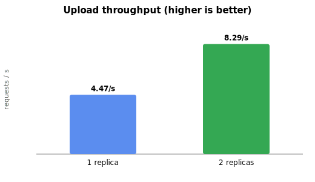
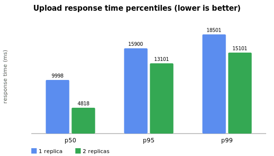

# D4 — File Service replication (1 vs 2 instances)

**Requirement D4:** replicate a service + load test, show improvement in ≥1 metric.

## Setup

- **Workload:** JMeter 5.6.3, 50 concurrent threads, 60 s, repeated multipart upload of a real ~5 MB MP4 (H.264+AAC) through the **Gateway** (`POST /api/files/upload` → `lb://file-service` via Eureka). Plan + scripts in [`load-tests/jmeter/`](../../load-tests/jmeter/).
- **Service under test:** `file-service` (upload is CPU-bound: Tika magic-bytes + `ffprobe` subprocess + S3 PUT per request). Each replica capped at **1 vCPU / 1 GB** (`deploy.resources.limits`), so a 2nd replica genuinely adds compute rather than sharing one over-provisioned JVM.
- **Variants:** `FILE_SERVICE_REPLICAS=1` then `=2` (same compose, only that variable changes). Gateway upload rate-limit raised for the run (`UPLOAD_RL_*`), since it is a separate security control, not the thing under test.
- **Host:** AMD Ryzen 5 5600 (6C/12T), 16 GB; JMeter and the stack share the host (Docker Desktop / WSL2).

## Results

| Metric | replicas=1 | replicas=2 | Δ |
|---|---|---|---|
| Throughput (req/s) | 4.47 | 8.29 | **+85 %** |
| Completed uploads (60 s) | 289 | 533 | +84 % |
| Error rate | 0.0 % | 0.0 % | — |
| Avg (ms) | 10 543 | 5 628 | −47 % |
| p50 (ms) | 9 998 | 4 818 | **−52 %** |
| p95 (ms) | 15 900 | 13 101 | −18 % |
| p99 (ms) | 18 501 | 15 101 | −18 % |

**Load-balancer distribution (replicas=2):** the two replicas served 266 vs 267 uploads during the run
(`http_server_requests_seconds_count` per container) — an even ~50/50 round-robin split, confirming the
Gateway/Eureka LB actually used both instances.

## Interpretation

The second replica improved **every** metric. Throughput nearly doubled (+85 %) and median latency
halved (−52 %), exactly as expected for a CPU-bound service capped at 1 vCPU each: with one replica the
50 concurrent uploads queue behind a single core; with two, the LB spreads them across two cores. The
tail (p95/p99) improves less (−18 %) because under saturation both setups still queue — the second
replica raises the ceiling, it doesn't make a saturated system idle. Criterion (≥1 metric improved): met,
with margin.

## Threats to validity

- Client (JMeter) and server share one host, so absolute latencies are inflated; the 1-vs-2 comparison is
  consistent because the only changed variable is the replica count.
- Traffic flows through the Gateway (real LB path) — the Gateway is not the bottleneck here (throughput
  scaled with file-service replicas, which it couldn't if the Gateway were the limit).
- A 60 s run on a shared dev box is a relative comparison, not an absolute capacity benchmark.

## Reproduce

See [`load-tests/jmeter/README.md`](../../load-tests/jmeter/README.md): generate the sample, bring the
stack up per variant, warm up + verify Eureka shows the expected instance count, then `run-loadtest.ps1 -Label rN`.
